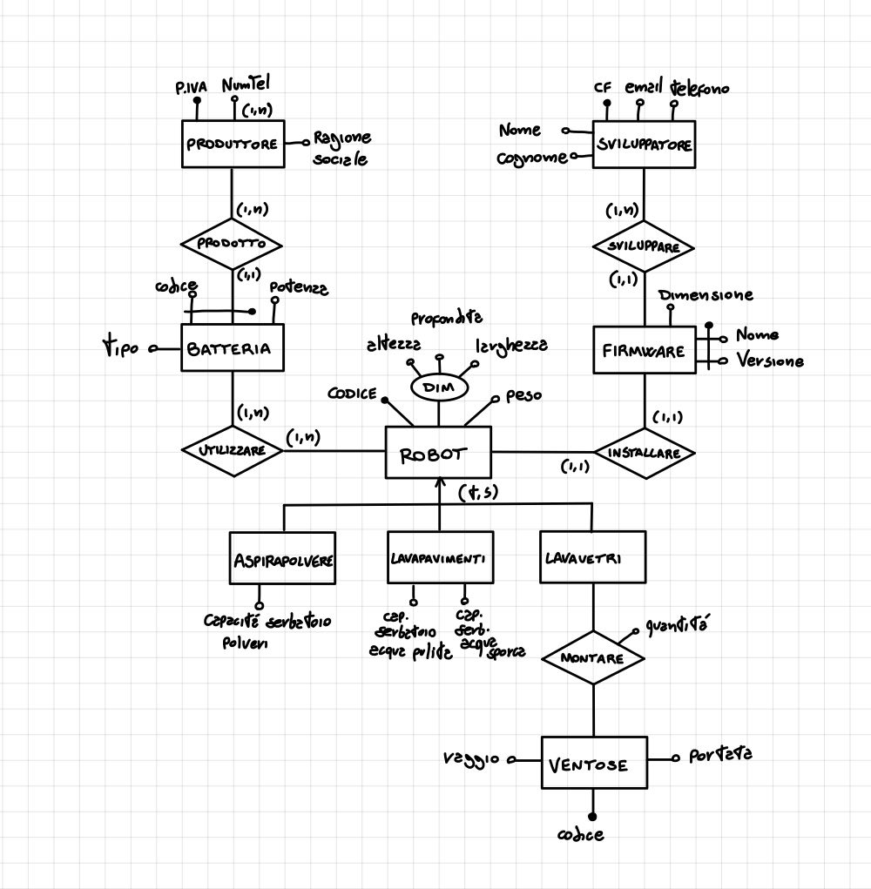

# SAM BD M4 E4

La società “Casa Sempre Pulita” (CSP) vuole realizzare una applicazione di basi di dati per organizzare e gestire la produzione
dei suoi robot per la pulizia domestica.

## DESCRIZIONE DEL PROBLEMA

### ROBOT

La CSP si occupa della produzione di piccoli robot per le pulizie domestiche.  
Ogni modello di robot prodotto è caratterizzato da un codice univoco, dalle dimensioni (composte da altezza, larghezza e profondità) espresse in cm e dal peso (espresso in Kg).  
I robot prodotti dalla CSP si suddividono in tre categorie: aspirapolveri, lavapavimenti e lavavetri (si noti che la CSP produce anche dei robot che combinano le caratteristiche dei robot aspirapolveri e lavapavimenti).

### MODELLI

I robot aspirapolvere sono caratterizzati dalla capacità del serbatoio di raccolta polveri (espressa in litri); i robot lavapavimento dalle capacità dei serbatoi per l’acqua pulita e per l’acqua sporca (entrambe espresse in litri).  
Invece per i robot lavavetri è importante tenere traccia di quali modelli di ventose montano e, per ciascun modello, del loro numero.  
Ogni modello di ventosa è caratterizzato da un codice univoco, dalla portata (espressa in Kg) e dal raggio della ventosa stessa.  
Si noti che ogni modello di robot lavavetri può montare diversi modelli di ventosa, e che lo stesso modello di ventosa può essere usato su differenti modelli di robot.

### BATTERIE

Ogni robot può utilizzare diversi modelli di batteria (come lo stesso modello di batteria può essere utilizzato su diversi modelli di robot).  
Di ogni modello di batteria si vuole tener traccia del tipo (e.g., al litio), e della potenza (espressa in mAh).  
Di ogni produttore di batterie si vuole, invece, tener traccia della PIVA (che associata ad un codice identifica univocamente ciascun modello di batteria), della ragione sociale e di uno o più numeri di telefono.  
Si noti che ogni produttore di batterie può produrrediversi modelli di batteria.

### FIRMWARE

In ogni modello di robot è, infine, installato un firmware appositamente studiato per quel modello e quindi non compatibile con gli altri modelli di robot.  
Per ogni firmware si vuole tenere traccia del nome, della versione (che lo identificano in modo univoco) e della dimensione (espressa in kB).  
Per lo sviluppo di questi firmware, la CSP si rivolge a sviluppatori esterni di comprovata fiducia e abilità.  
Per ogni sviluppatore la CSP è interessata a tenere traccia del CF, del nome, del cognome, del numero di telefono di contatto e della email.  
Si noti che mentre ogni sviluppatore può aver sviluppato più firmware, ogni
firmware è stato sviluppato da un solo sviluppatore.

## RICHIESTE

1. Progettare lo schema E-R che descrive le entità e le associazioni sopra descritte.
(si ricorda che lo schema concettuale deve comprendere l’indicazione delle cardinalità di associazioni e attributi e l’indicazione degli identificatori di tutte le entità)
2. Tradurre lo schema E-R in tabelle di una base di dati relazionale, indicando anche eventuali vincoli di integrità referenziale.

## Soluzione domanda 1

Diagramma E-R prima di essere ristrutturato

- Dobbiamo ristrutturare la gerarichia dell'entità *robot* con un collasso verso l'alto. Si aggiungono 3 selettori: *SelAspira*, *SelLava* e *SelVetri*
- Dobbiamo ristrutturare l'attributo complesso *dim* in 3 attributi semplici collegati semplicemente a *robot*
- Dobbiamo ristrutturare l'attributo *NumTel* di *produttore* rendendolo un entità *rubrica* a se stante in relazione con produttore

Diagramma E-R dopo esser stato ristrutturato

## Soluzione domanda 2

| Relazione  | Attributi |
| :--------- | :-------- |
| **ROBOT**  | **codice**, peso, altezza, larghezza, profondità, cap. acqua pulita, cap. acqua sporca, cap. serb. polveri, sel. lavavetri, sel. lavapavimenti, sel. aspirapolvere  |
| **VENTOSE** | **codice**, portata, raggio  |
| **PRODUTTORE** | **PIVA**, ragione sociale  |
| **RUBRICA** | Content Cell  |
| **BATTERIA** | Content Cell  |
| **FIRMWARE** | Content Cell  |
| **SVILUPPATORE** | Content Cell  |
| **MONTARE_VENTOSA** | Content Cell  |
| **UTILIZZARE_BATTERIA** | Content Cell  |
